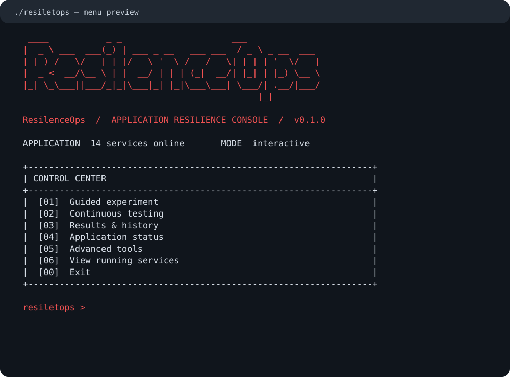
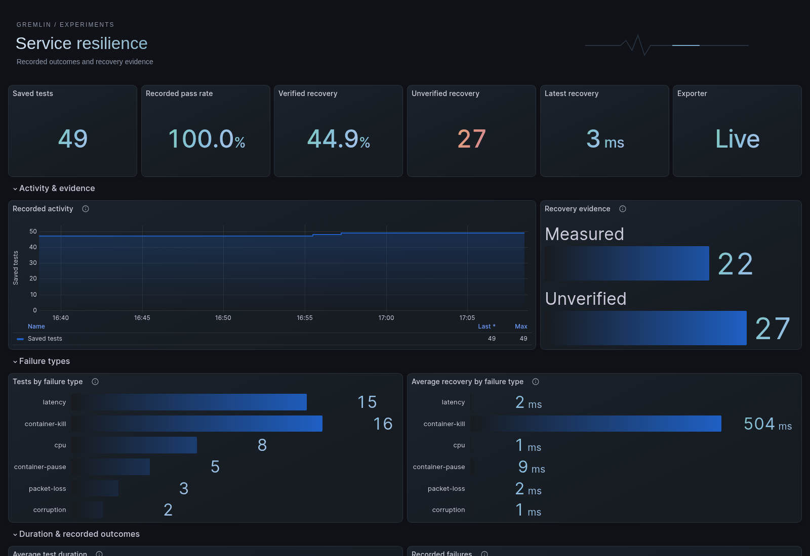

# ResilenceOps · v0.1.0

Test how your application handles failures, check its recovery, and view results in Grafana.



## What you can do

- Run a guided failure test on an application service.
- Repeat tests continuously and check recovery after each fault.
- View running services and saved test results.
- Explore resilience metrics in an animated Grafana dashboard.

The menu lists only containers belonging to the configured application. Other Docker applications and monitoring containers stay outside the target list.

## Before you start

You need **Go 1.22 or newer**, **Git**, and **Docker with Docker Compose**. Docker must be running and accessible to your user. Python 3 is optional for checking dashboard data.

The default test application is [Sock Shop](https://github.com/microservices-demo/microservices-demo).

## Setup

### 1. Get ResilenceOps

```bash
git clone https://github.com/santhoshdodo2721/Gremlin.git
cd Gremlin
```

Already have the project? Open its root directory and continue below.

### 2. Start the application and monitoring

Clone the test application once:

```bash
git clone https://github.com/microservices-demo/microservices-demo.git aut/microservices-demo
```

Start it from the project root:

```bash
docker compose up -d
```

This starts Sock Shop, the metrics exporter, Prometheus, and Grafana together. Use `docker compose up` to keep logs in the terminal, or `docker compose up -d` to run everything in the background. The root Compose file uses Compose `include`, which requires Docker Compose 2.20 or newer.

Wait for startup, then open [the storefront](http://localhost/). Sock Shop uses host ports **80** and **8080**, so those ports must be available.

### 3. Build the testing tools

```bash
docker build -t gremlin-helper:latest -f tools/netem.Dockerfile .
go build -o resiletops ./cmd/gremlin
```

The helper supplies `tc` for latency, packet-loss, and corruption tests.

### 4. Open the menu

```bash
./resiletops
```

Enter a number and press **Enter**.

| Option | What it does |
| --- | --- |
| **1 — Guided experiment** | Choose a service, fault, and recovery check. |
| **2 — Continuous testing** | Repeat a sequence of faults with recovery checks. |
| **3 — Results & history** | Read saved experiments and resilience history. |
| **4 — Application status** | Check the application and monitoring endpoints. |
| **5 — Advanced tools** | Run custom tests, load tests, and service-limit tests. |
| **6 — View running services** | Show service names, container names, and status. |
| **0 — Back / Exit** | Return to the previous menu or close the console. |

For a first test, choose **6** to confirm your services are running, then choose **1** and select a short container-pause experiment.

## View the dashboard

Monitoring starts with the application. From the project root, start or rebuild the complete stack:

```bash
docker compose up -d --build
```

Open [Grafana](http://localhost:3001), sign in with the initial credentials **admin / admin**, and open **Gremlin / Experiments**. Prometheus is available at [localhost:9091](http://localhost:9091).



The dashboard shows saved test counts, recorded success, recovery evidence, and fault types. It uses gradient figures and subtle animation with reduced-motion support. The screenshot shows example saved history; your numbers depend on your tests.

Run a test to create data. Allow a few seconds for Prometheus to scrape the results and Grafana to refresh. Missing recovery measurements stay unmeasured; they are not counted as verified recovery.

To compare live dashboard values with saved reports:

```bash
python3 monitoring/verify-data.py
```

## Run continuous tests

Use menu option **2**, or run this bounded example:

```bash
./resiletops targets
./resiletops continuous \
  --target docker-compose-front-end-1 \
  --attacks container-pause \
  --duration-s 1 \
  --interval-s 1 \
  --cycles 2
```

Use a container name from `./resiletops targets` if yours differs. `--cycles 0` runs continuously. Tests execute one at a time, check recovery, and pause between faults. A failed test stops the sequence. Press **Ctrl+C** to stop and wait for the active fault to be cleaned up.

Supported faults: latency, packet loss, corruption, CPU throttling, container pause, and restart.

## Settings and saved results

Edit `config.json` to change the application or recovery endpoint:

| Setting | Default | Purpose |
| --- | --- | --- |
| `application_directory` | `aut/microservices-demo/deploy/docker-compose` | Selects application containers through Compose ownership labels. |
| `target_health_url` | `http://localhost/` | Checks HTTP availability after a fault. |
| `docker_socket` | `/var/run/docker.sock` | Connects to Docker. |
| `reports_file` | `gremlin-reports.json` | Stores experiment results. |
| `metrics_addr` | `:9090` | Sets the exporter's listening address. |

The application directory is resolved relative to the config file. For backend-specific recovery, choose an endpoint that checks that backend; the storefront check alone verifies HTTP availability.

Reports are saved in `gremlin-reports.json`. Service-limit history is saved in `resilience-history.json`. Keep these files when upgrading. If you change the report location, update the monitoring exporter configuration and mount too.

More commands:

```bash
./resiletops version
./resiletops report
./resiletops --help
./resiletops schedule --file schedule.json
```

Scheduling starts only when you run the schedule command.

## Common problems

| Problem | What to check |
| --- | --- |
| No application services appear | Start Sock Shop and confirm `application_directory` points to its Compose directory. |
| Docker is unavailable | Check that Docker is running and your user can access its socket. |
| Latency or packet-loss test fails | Build `gremlin-helper:latest` using the command in setup. |
| Grafana shows no data | Run an experiment, start monitoring, and check `docker compose ps`. |
| Storefront does not open | Check Sock Shop startup and whether host ports 80 or 8080 are already in use. |

## Stop the containers

```bash
docker compose stop
```

## Development

```bash
go test -race ./...
go vet ./...
go build -o resiletops ./cmd/gremlin
```

GitHub Actions builds the tools, starts Sock Shop, runs experiments, and saves reports. Source code remains under `cmd/gremlin` and `internal`; the current user-facing launcher is `./resiletops`.
